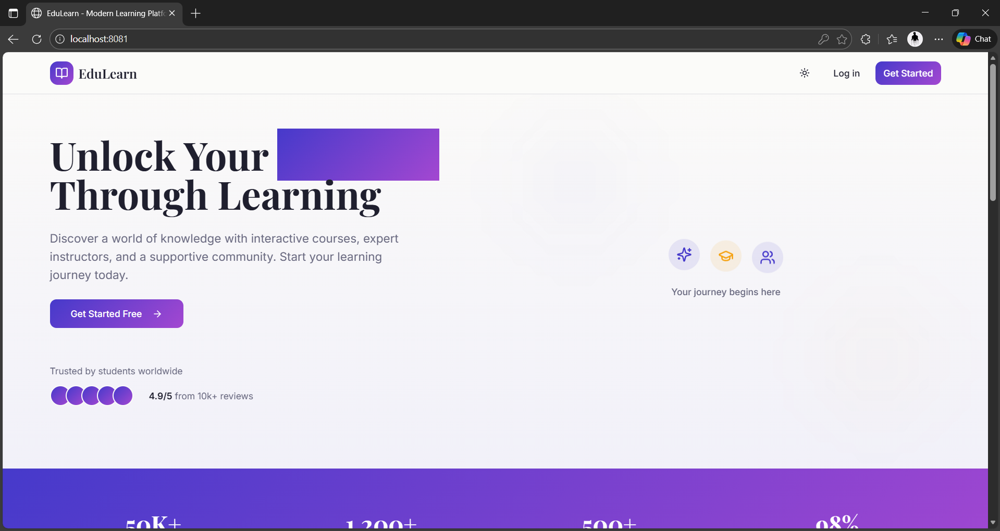
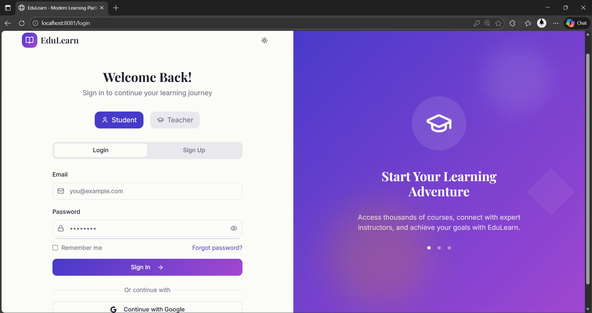
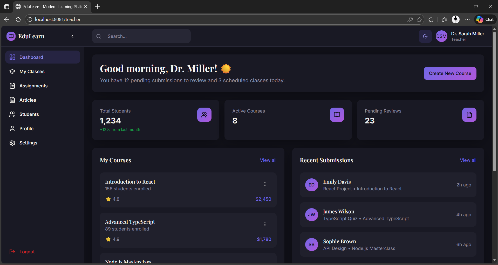
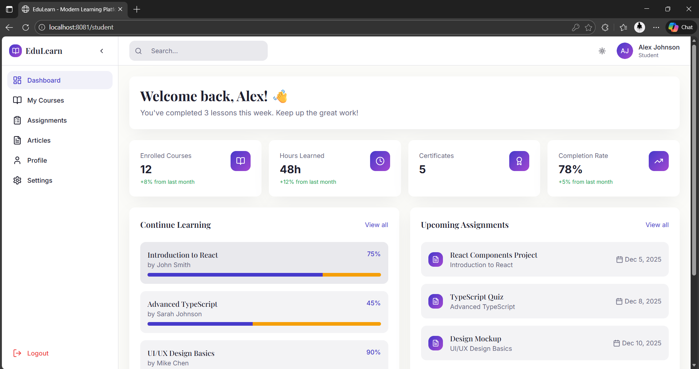

# Welcome to EduLearn – Modern LMS UI

A modern and intuitive Learning Management System (LMS) interface built using **React**, **TypeScript**, **Vite**, **Tailwind CSS**, and **shadcn-ui**. Designed to enhance the student learning experience with a clean dashboard, course management, assignments tracking, and academic insights.

## Screenshots

  
  

